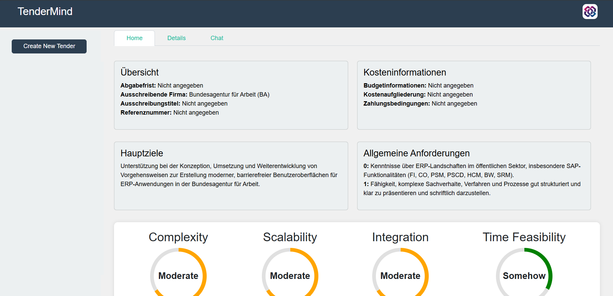

# TenderMind

TenderMind is a web solution designed to streamline the management of tenders.
Leveraging AI-powered data extraction, TenderMind allows users to upload tender documents, automatically extract and organize key information, visualize the KPI metrics for tender. 
to help easily undesrand and take decision to pursue the tender.
User can also interact through an integrated chat interface to do detailed analysis.

## Features

- **Document Upload:** Easily upload tender documents (e.g., PDFs) through the user-friendly interface.
- **AI-Powered Data Extraction:** Automatically extract essential tender details using AI for efficient data management.
- **Dashboard:** View and manage all uploaded tenders in a centralized dashboard with organized cards displaying key information.
- **Metrics:** Visualize important metrics on home page. 
- **Add-ons Management:** Select and view additional tender details through customizable add-ons.
- **Chat Interface:** Interact with an AI-powered chat for assistance and information retrieval related to tenders.
- **Data Analysis:** View complexity of tenders through Metrics on dashboard.

## Technologies Used

- **Backend:** Python, Flask, SQLAlchemy
- - **AI & Data Processing:** Cohere API, LangChain, FAISS
- **Frontend:** HTML, CSS (Bootstrap), JavaScript (jQuery)
- **Database:** SQLite
  
## Installation

### Prerequisites

- Python 3.10 or higher
- Git

### Steps

1. **Clone the Repository**
    ```bash
    git clone https://github.com/yourusername/tenderMind.git
    cd tenderMind
    ```

2. **Create a Virtual Environment**
    ```bash
    python -m venv venv
    source venv/bin/activate  # On Windows: venv\Scripts\activate
    ```

3. **Install Dependencies**
    ```bash
    pip install -r requirements.txt
    ```

4. **Set Up Environment Variables**
   
   Create a `.env` file in the root directory and add your Cohere API key:
    ```
    COHERE_API_KEY=your_cohere_api_key
    ```

5. **Initialize the Database**
    ```bash
    python app.py
    ```
    This will create the `tenders.db` SQLite database.

6. **Run the Application**
    ```bash
    python app.py
    ```
    The application will be accessible at `http://127.0.0.1:5000/`.

## Usage

1. **Access the Application:**
   Open your web browser and navigate to `http://127.0.0.1:5000/`.

2. **Upload a Tender Document:**
   - On the homepage, use the upload form to select and upload a tender document.
   - After uploading, you will be redirected to the dashboard.

3. **View and Manage Tenders:**
   - The dashboard displays all uploaded tenders.
   - Click on a tender to view detailed information extracted by the AI.

4. **Interact Through Chat:**
   - Navigate to the "Chat" tab to interact with the AI for assistance and information related to your tenders.

## Screenshots



## License

This project is licensed under the [MIT License](LICENSE).

## Acknowledgements

- [Flask](https://flask.palletsprojects.com/)
- [Bootstrap](https://getbootstrap.com/)
- [Cohere](https://cohere.ai/)
- [LangChain](https://langchain.com/)
- [FAISS](https://faiss.ai/)
